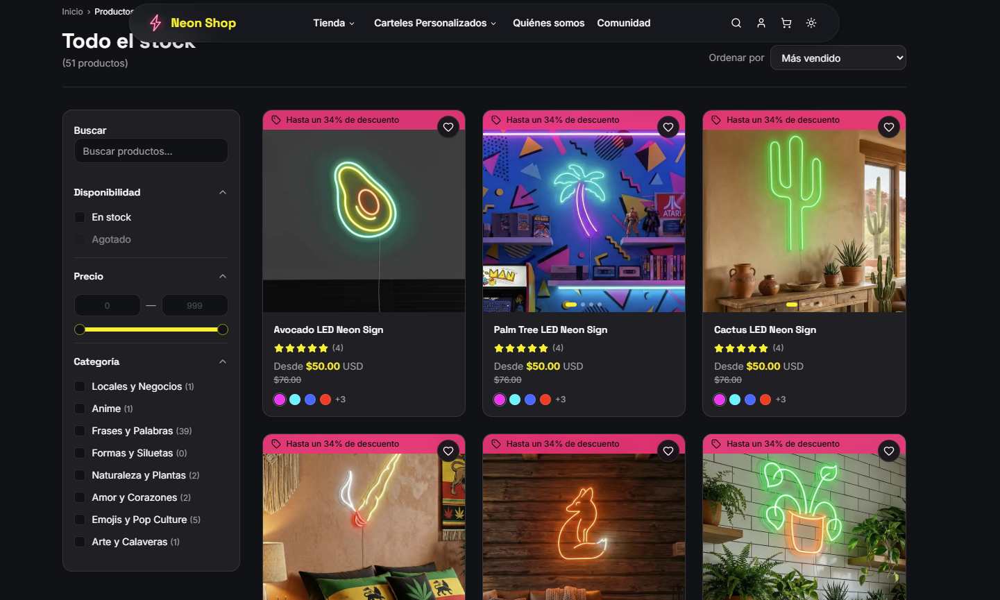

<div align="center">

# Neon Shop

**Plataforma e-commerce full-stack para un taller de letreros LED / neón personalizados**

Catálogo · Carrito · Checkout vía WhatsApp · Panel admin · Showroom comunitario

<br />

[](https://github.com/JarolGabriel/neon-shop)
[](https://github.com/JarolGabriel/neon-shop)

<br />


<br />

[**Ver repositorio**](https://github.com/JarolGabriel/neon-shop) ·
[**Inicio rápido**](#inicio-rápido) ·
[**Rutas**](#rutas-de-la-aplicación) ·
[**Migraciones**](#base-de-datos-y-migraciones) ·
[**Variables**](#variables-de-entorno)

</div>

---

## Vista previa



> Captura del catálogo con grid de productos, precios en USD, badges de descuento y diseño cyberpunk (modo claro/oscuro).

---

## Descripción

**Neon Shop** es una tienda en línea moderna para un taller de letreros de neón flex y LED. Combina un catálogo de productos listos para comprar, un flujo de **diseño personalizado**, un **showroom comunitario** (reseñas con fotos) y un **panel de administración** completo.

El checkout **no usa pasarela de pago**: el pedido se confirma por formulario, se registra en la base de datos, se envían correos vía **Resend** y el cliente continúa la compra por **WhatsApp** con un mensaje prellenado.

---

## Características principales

### Tienda pública

- Catálogo con filtros por categoría, precio, color, tamaño y stock
- Ficha de producto con selector de tamaño (12 tiers oficiales en cm), colores y precio dinámico
- Precio tachado (`compare_at_price`) y badge de descuento
- Carrito con `session_id` para usuarios anónimos
- Favoritos, reseñas de producto y descuentos por volumen (2+ / 3+ ítems)
- Personalizador de texto neón con preview en tiempo real
- Formulario de diseño personalizado (upload de logo)
- Showroom / comunidad con likes y comentarios moderados
- FAQ, políticas legales, tema claro/oscuro

### Panel admin (`role: admin`)

- Dashboard, productos, categorías, órdenes, diseños personalizados
- Promociones con imágenes (hero home + comunidad mobile)
- Moderación de showroom, configuración del sitio (WhatsApp, redes, horarios)
- CRUD con subida de imágenes a Supabase Storage

### Backend

- **43 API Routes** en Next.js App Router (`/src/app/api/`)
- PostgreSQL en Supabase con migraciones versionadas
- Autenticación JWT (sign-in / sign-up / recuperación de contraseña)
- Emails transaccionales con Resend

---

## Stack tecnológico

| Capa | Tecnología |
|------|------------|
| Framework | [Next.js 16](https://nextjs.org/) (App Router) |
| UI | [React 19](https://react.dev/), [Tailwind CSS v4](https://tailwindcss.com/), [shadcn/ui](https://ui.shadcn.com/) |
| Animaciones | [Framer Motion](https://www.framer.com/motion/) |
| Formularios | [React Hook Form](https://react-hook-form.com/) + [Zod](https://zod.dev/) |
| Base de datos | [Supabase](https://supabase.com/) (PostgreSQL + Storage + Auth) |
| Email | [Resend](https://resend.com/) |
| Temas | [next-themes](https://github.com/pacocoursey/next-themes) (dark por defecto) |
| Deploy | [Vercel](https://vercel.com/) |

---

## Arquitectura del proyecto

```
src/
├── app/
│   ├── (public)/          # Tienda, showroom, carrito, personalizador
│   ├── (admin)/admin/     # Panel de administración
│   ├── (auth)/            # Login, registro, perfil
│   └── api/               # Backend REST (no consumir Supabase desde el cliente)
├── components/
│   ├── ui/                # shadcn/ui
│   ├── shared/            # Navbar, Footer, etc.
│   ├── store/             # Componentes de la tienda
│   ├── admin/             # Componentes del admin
│   └── showroom/          # Feed social
├── context/               # AuthContext, CartContext
├── hooks/                 # useCart, useAuth, useProducts, etc.
├── lib/                   # api.ts, utils, pricing, WhatsApp helpers
└── types/                 # Tipos TypeScript + Supabase generated

supabase/
└── migrations/            # Migraciones SQL versionadas
```

> **Regla clave:** el frontend **nunca** llama a Supabase directamente. Toda comunicación con la BD pasa por `/api/*` y funciones centralizadas en `src/lib/api.ts`.

---

## Rutas de la aplicación

### Tienda pública

| Ruta | Descripción |
|------|-------------|
| `/` | Home — hero, categorías, productos destacados, testimonios, FAQ |
| `/productos` | Catálogo con filtros |
| `/productos/[slug]` | Detalle de producto |
| `/carrito` | Carrito de compras |
| `/mi-pedido` | Confirmación de orden + enlace WhatsApp |
| `/favoritos` | Productos guardados |
| `/showroom` | Feed de reseñas con fotos |
| `/comunidad` | Promos y contenido comunitario |
| `/diseno-personalizado` | Solicitud de diseño a medida (logo) |
| `/personalizar` | Personalizador de texto neón |
| `/quienes-somos` | Página institucional |
| `/preguntas-frecuentes` | FAQ |
| `/politicas/[slug]` | Políticas legales |

### Autenticación

| Ruta | Descripción |
|------|-------------|
| `/auth/login` | Inicio de sesión |
| `/auth/registro` | Registro de cliente |
| `/auth/recuperar-contrasena` | Solicitud de reset |
| `/auth/restablecer-contrasena` | Nueva contraseña |
| `/perfil` | Perfil del usuario |

### Panel admin (requiere `role: admin`)

| Ruta | Descripción |
|------|-------------|
| `/admin` | Dashboard |
| `/admin/productos` | Gestión de productos e imágenes |
| `/admin/categorias` | Categorías |
| `/admin/ordenes` | Órdenes y estados |
| `/admin/disenos` | Diseños personalizados |
| `/admin/promociones` | Promociones e imágenes |
| `/admin/showroom` | Moderación de reseñas |
| `/admin/comunidad` | Gestión comunitaria |
| `/admin/configuracion` | Settings del sitio |

### API (referencia)

Endpoints públicos, autenticados y admin documentados en `.cursorrules`. Ejemplos:

- `GET /api/products` — catálogo paginado
- `GET /api/products/[slug]` — detalle
- `POST /api/cart` · `POST /api/orders` — carrito y pedidos
- `POST /api/auth/sign-in` · `POST /api/auth/sign-up`
- `GET /api/admin/*` — rutas protegidas (Bearer token + rol admin)

---

## Inicio rápido

### Requisitos

- **Node.js** 20+
- **npm** 10+
- Proyecto en [Supabase](https://supabase.com/) (URL + keys)
- Cuenta en [Resend](https://resend.com/) (emails)
- [Supabase CLI](https://supabase.com/docs/guides/cli) (recomendado para migraciones)

### 1. Clonar e instalar

```bash
git clone https://github.com/JarolGabriel/neon-shop.git
cd neon-shop
npm install
```

### 2. Variables de entorno

```bash
cp .env.example .env
```

Completa al menos:

| Variable | Descripción |
|----------|-------------|
| `NEXT_PUBLIC_SUPABASE_URL` | URL del proyecto Supabase |
| `NEXT_PUBLIC_SUPABASE_ANON_KEY` | Anon key |
| `SUPABASE_SERVICE_ROLE_KEY` | Service role (solo servidor) |
| `RESEND_API_KEY` | API key de Resend |
| `RESEND_FROM_EMAIL` | Remitente verificado |
| `NEXT_PUBLIC_SITE_URL` | URL pública (`http://localhost:3000` en dev) |
| `ADMIN_EMAILS` | Emails que reciben rol admin al registrarse |

Opcional: `NEXT_PUBLIC_WHATSAPP_NUMBER` como fallback en desarrollo.

### 3. Base de datos y migraciones

Las migraciones viven en `supabase/migrations/`. Orden cronológico (desde el schema inicial hasta precios/tiers actuales):

| Migración | Descripción |
|-----------|-------------|
| `20260519193000_init_schema.sql` | products, categories, cart, variants… |
| `20260522023206_add_custom_designs_table.sql` | Diseños personalizados |
| `20260524002620_create_orders_tables.sql` | Órdenes |
| `…` | showroom, reviews, site settings, storage policies |
| `20260611000000_add_product_available_options.sql` | `available_sizes` / `available_colors` |
| `20260613120000_update_product_sizes_and_prices.sql` | Tiers oficiales en cm |
| `20260613140000_restore_compare_at_prices.sql` | Precios tachados |

**Opción A — Supabase CLI (recomendado)**

```bash
# Instalar CLI: https://supabase.com/docs/guides/cli/getting-started
supabase login
supabase link --project-ref <TU_PROJECT_REF>
supabase db push
```

**Opción B — SQL Editor en Supabase Dashboard**

1. Abre SQL Editor en tu proyecto Supabase.
2. Ejecuta cada archivo de `supabase/migrations/` en orden (por timestamp en el nombre).
3. Verifica con:

```sql
SELECT slug, price, compare_at_price, size
FROM products
WHERE is_active = true
ORDER BY name
LIMIT 10;
```

### 4. Configuración inicial del sitio

En **Admin → Configuración** o vía `site_settings`:

- `whatsapp_number` — número con código de país (ej. `58412…` o `1214…`)
- `support_email`, `address`, `business_hours`
- Redes sociales (`instagram_url`, `tiktok_url`, etc.)

Seed opcional de redes:

```bash
node scripts/seed-site-settings-social.mjs
```

### 5. Arrancar en desarrollo

```bash
npm run dev
```

Abre [http://localhost:3000](http://localhost:3000).

### Scripts disponibles

| Comando | Descripción |
|---------|-------------|
| `npm run dev` | Servidor de desarrollo (`0.0.0.0:3000`) |
| `npm run build` | Build de producción |
| `npm run start` | Servidor de producción |
| `npm run lint` | ESLint |
| `npm run seed:showroom` | Seed de posts de showroom |
| `npm run seed:showroom:clean` | Limpia seed de showroom |

---

## Flujo de compra

```
Catálogo → Carrito → Checkout / formulario → POST /api/orders → Email Resend → /mi-pedido → WhatsApp prellenado
```

1. El usuario completa datos de entrega.
2. El backend crea la orden y vacía el carrito.
3. Se muestra confirmación con link a WhatsApp usando `whatsapp_number` de settings.

---

## Precios por tamaño (referencia de negocio)

Tiers oficiales definidos en `src/lib/product-size-pricing.ts`:

| Tamaño | Precio USD |
|--------|------------|
| 30 × 30 cm | $35 |
| 40 × 40 cm | $50 |
| 40 × 50 cm | $60 |
| 40 × 60 cm | $65 |
| 40 × 70 cm | $70 |
| 50 × 50 cm | $60 |
| 50 × 80 cm | $90 |
| 60 × 60 cm | $70 |
| 70 × 70 cm | $90 |
| 80 × 80 cm | $120 |
| 90 × 90 cm | $140 |
| 100 × 100 cm | $180 |

El precio tachado se calcula automáticamente (markup ~52%) salvo override manual en admin.

---

## Diseño

Paleta cyberpunk documentada en `DESIGN_SYSTEM.md`:

- `cyber-yellow` · `neon-pink` · `vite-purple` · `neon-surface`
- Modo oscuro por defecto con toggle en navbar
- Tokens en `globals.css` vía `@theme inline` (Tailwind v4)

---

## Despliegue (Vercel)

1. Importa el repo [JarolGabriel/neon-shop](https://github.com/JarolGabriel/neon-shop) en Vercel.
2. Configura todas las variables de `.env.example`.
3. Asegura que las migraciones ya están aplicadas en Supabase de producción.
4. Verifica dominio en Resend para emails en producción.
5. Deploy.

`next.config.ts` incluye rewrite de `/storage/*` hacia Supabase Storage e imágenes remotas permitidas.

---

## Estructura de roles

| Rol | Acceso |
|-----|--------|
| `customer` | Tienda, carrito, showroom, favoritos, perfil |
| `admin` | Todo lo anterior + `/admin/*` |

Los emails listados en `ADMIN_EMAILS` reciben rol admin al registrarse.

---

## Contribución

Este repositorio es un proyecto privado/comercial. Para cambios internos:

1. Crea una rama desde `main`.
2. Respeta las convenciones en `.cursorrules` (API centralizada, sin Supabase en cliente, RHF + Zod).
3. Abre PR con descripción y plan de prueba.

---

## Licencia

Proyecto privado — todos los derechos reservados.

---

<div align="center">

Desarrollado con **Next.js** y **Supabase**

[github.com/JarolGabriel/neon-shop](https://github.com/JarolGabriel/neon-shop)

</div>
